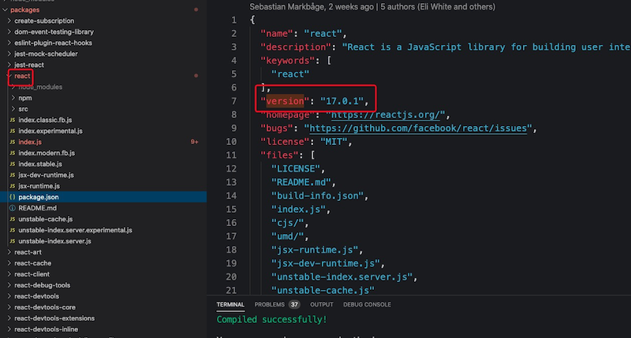
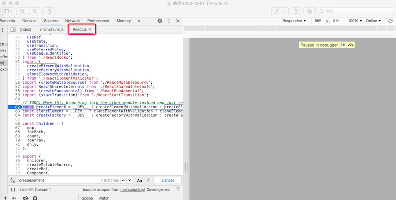

<!--
 * @Author: 波仔糕
 * @LastModifiedBy: 波仔糕
-->
# debug_react_17
调试React17版本脚手架项目
#### 调试步骤
+ 将项目clone到本地进入src/react目录执行yarn进行依赖安装（不要用npm install进行依赖安装，因为npm不能识别link命令）
+ 进入项目根目录./进行yarn依赖安装
+ 进入src/react/scripts/eslint-rules目录执行npm link将eslint-plugin-react-internal安装到global
+ 进入项目目录./node_modules/react-scripts然后执行npm link eslint-plugin-react-internal实现组件依赖全局global
+ 进入项目目录./执行npm run start运行调试react库

#### 调试效果

